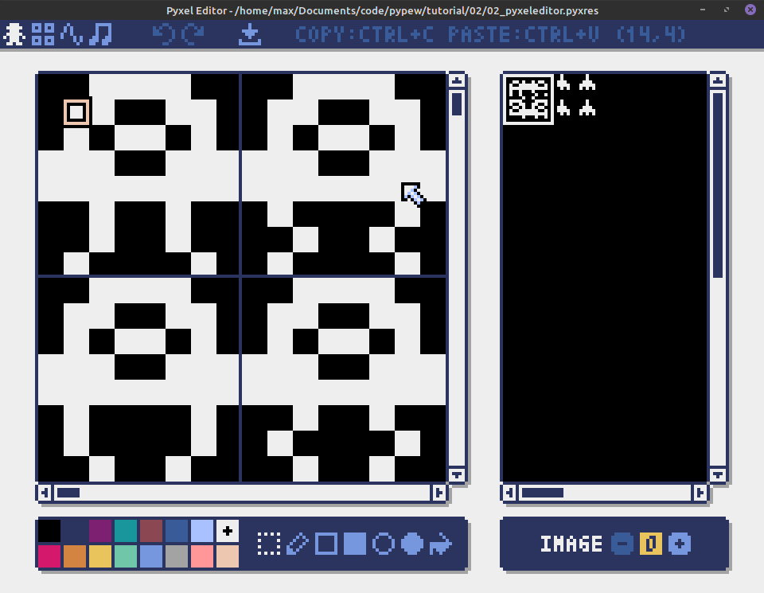

# pypew: A tutorial for [Pyxel](https://github.com/kitao/pyxel)

This tutorial aims to provide a quick and dirty getting started guide for pyxel.
The game has obvious flaws and the tutorial will not cover all features of the engine.

## What is Pyxel?

Pyxel is a retro game engine with restrictions on colors, sound channels and draw area 
([Specs](https://github.com/kitao/pyxel#Specifications)).
This leads to a simpler engine, and games can take advantage of the special circumstances.
For example, the final game will detect collision by pixel color.

Pyxel only provides operations to draw, play sounds and detect input, so you will have to
either provide your collision detection and physics yourself or use one of the many libraries.

## Installation

On Linux, it should suffice to install pyxel via pip or in your favorite IDE.
I recommend following the instructions at [GitHub](https://github.com/kitao/pyxel#how-to-install).

This will also include some further samples for Pyxel.

## How to use this tutorial

This file contains the lessons, and the numbered folders contain the final files
from every lesson. The goal is a small space shooter, with some sounds and simple hit detection.

## 01 Game Setup

The most basic game you can create in Pyxel displays nothing but a black screen.
To do this, we need to import Pyxel, initialize it, and run.

While we could do this in the main method, we can also wrap Pyxel into a class.

```python
import pyxel

class App:
    def __init__(self):
```

The `pxyel.init` method takes some arguments, we only need width, height, caption and fps.
This will create a 160x120 window with the caption pypew.

```python
        pyxel.init(160,120, caption="pypew", fps=25)
        pyxel.run(self.update, self.draw)
```

The Pyxel run method provides the game loop, executing the update and the draw function every tick.
This means we need to define them as well before we're able to put something on the screen.

Finally, we can start the game by creating an instance of the App class.

```python
    def update(self):
        if pyxel.btnp(pyxel.KEY_Q):
            pyxel.quit()


    def draw(self):
        pyxel.cls(pyxel.COLOR_CYAN)

App()
```

`pyxel.btnp(pyxel.KEY_Q)` will return `True` if the `Q`-key is pressed, ending the game.
`pyxel.cls(COLOR)` fills the whole screen with the specified color, you can use
either integers (0-15) or the named constants.

The full example is [here](./01/01_pyxel_setup.py).

## 02 Creating sprites

Now that we can draw a window and set it's background color, we should add some sprites.
This tutorial uses the integrated editor, but it is also possible to use spritesheets in a 
similar fashion.

### pyxeleditor

Pyxel ships with it's own editor. You can invoke it by running `pyxeleditor` from the command line.
If no argument is given, it will work on the file `my_resource.pyxres`, otherwise it will open and edit
the specified file.

It has four main windows, the sprite editor, the tilemap editor, the sound editor, and finally
the music editor.

#### Sprite Editor



The sprite editor consists of the drawing area, the "map", the drawing tools and the selector
for the image bank.
To create a sprite, simply pick a color and draw. The active drawing area is 16x16. You can create
bigger sprites, but they become harder to edit.

> Tip: If you're using smaller (at most 8x8) sprites, you can edit multiple animation frames
> side by side.

Resource files support up to three image banks. You should either put all sprites into the same 
image bank for smaller games or group them by the "layer" they appear in game. This is especially
important when you're using tilemaps, since they only support loading images from one image bank.